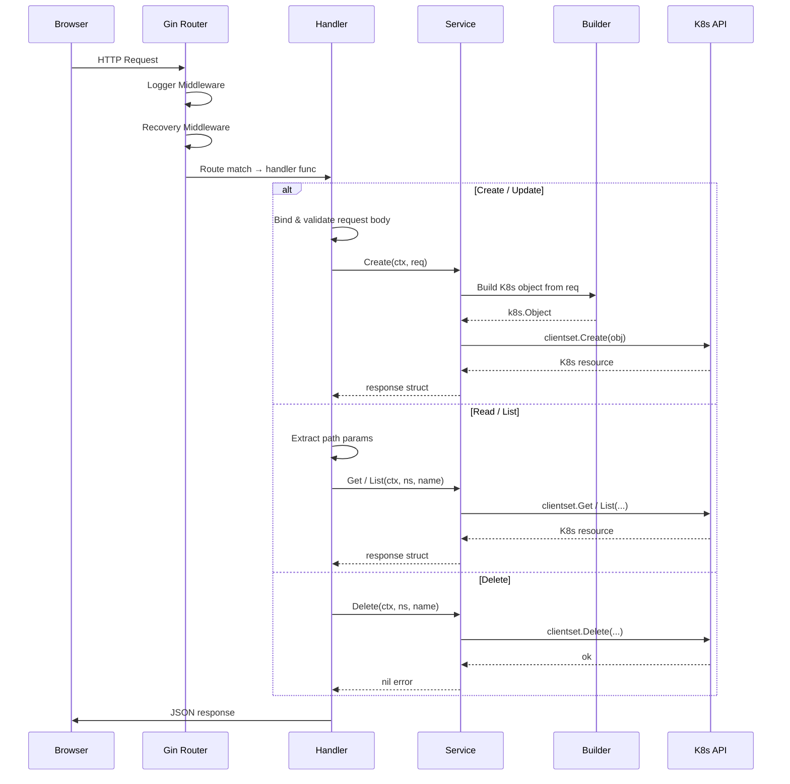
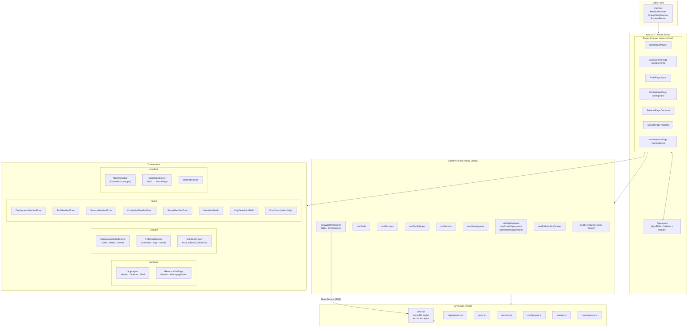
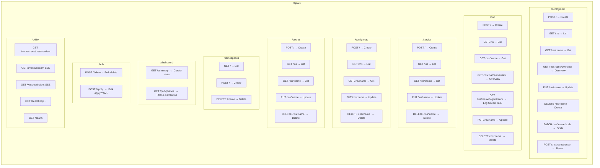
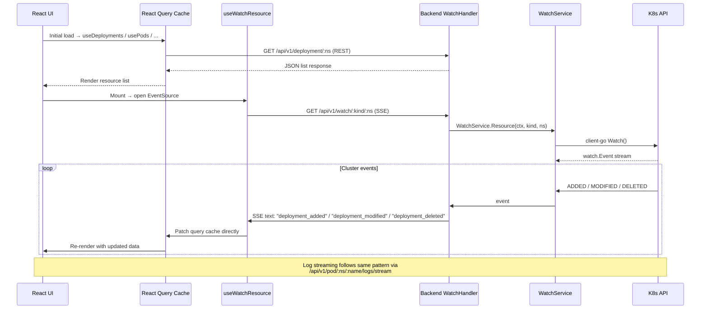
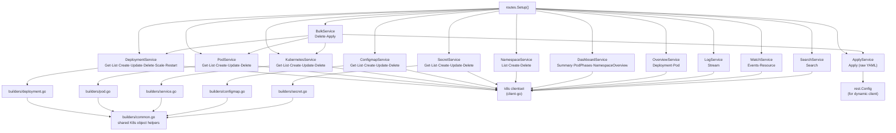
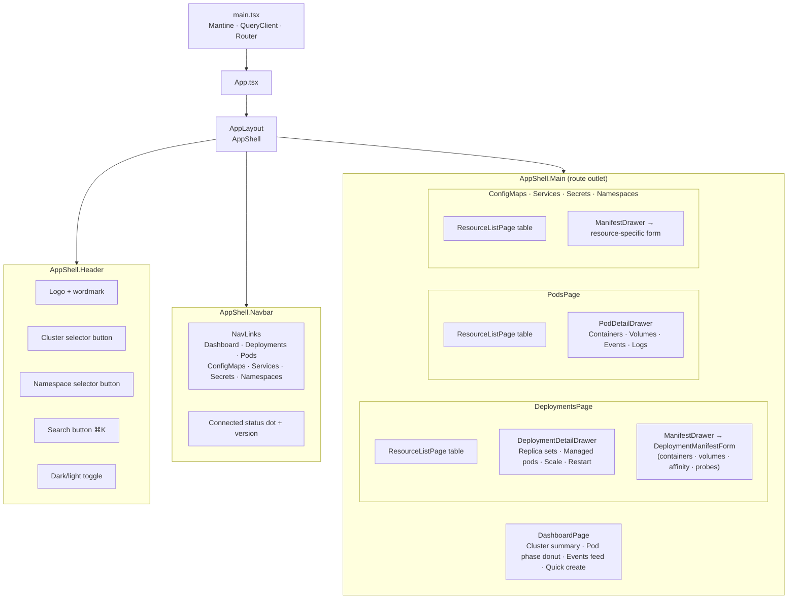
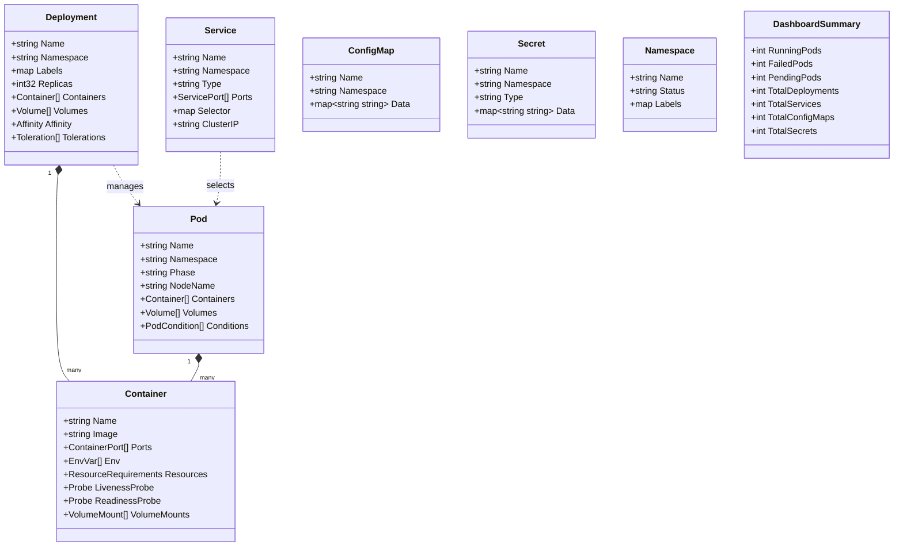
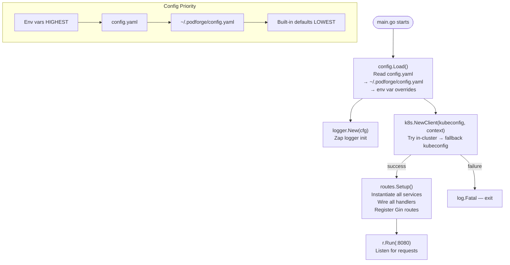
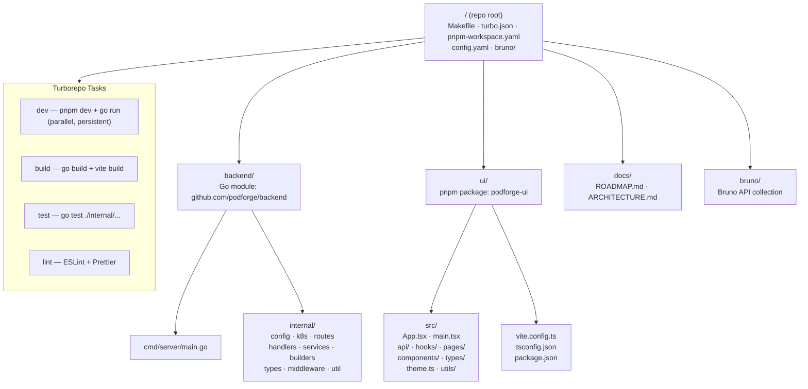

# PodForge — Architecture Diagrams

---

## 1. System Overview

```mermaid
graph TB
    subgraph Browser["Browser"]
        UI["React 19 + Vite\n:5173 (dev)"]
    end

    subgraph PodForge["PodForge Backend  :8080"]
        GIN["Gin Router"]
        MW["Middleware\n(Zap Logger, Recovery)"]
        ROUTES["routes.Setup()"]

        subgraph Handlers["Handlers Layer"]
            DH["deployment_handler"]
            PH["pod_handler"]
            SH["service_handler"]
            CMH["configmap_handler"]
            SCH["secret_handler"]
            NSH["namespace_handler"]
            DASH["dashboard_handler"]
            OVH["overview_handler"]
            LH["log_handler"]
            WH["watch_handler"]
            BLK["bulk_handler"]
            SRCH["search_handler"]
        end

        subgraph Services["Services Layer"]
            DS["DeploymentService"]
            PS["PodService"]
            SS["KubernetesService"]
            CS["ConfigmapService"]
            SEC["SecretService"]
            NS["NamespaceService"]
            DSVC["DashboardService"]
            OVS["OverviewService"]
            LS["LogService"]
            WS["WatchService"]
            BS["BulkService"]
            AS["ApplyService"]
            SSVC["SearchService"]
        end

        subgraph Builders["Builders Layer"]
            DB["deployment.go"]
            PB["pod.go"]
            SB["service.go"]
            CMB["configmap.go"]
            SECB["secret.go"]
            CB["common.go"]
        end

        CFG["config.go\nconfig.yaml / env"]
        K8SCLIENT["k8s/client.go\nclient-go clientset"]
    end

    subgraph Kubernetes["Kubernetes Cluster"]
        KAPI["K8s API Server"]
        subgraph Resources["Resources"]
            KDEP["Deployments"]
            KPOD["Pods"]
            KSVC["Services"]
            KCM["ConfigMaps"]
            KSEC["Secrets"]
            KNS["Namespaces"]
        end
        KEVT["Events"]
    end

    UI -- "REST  /api/v1/*" --> GIN
    UI -- "SSE  /api/v1/watch/:kind/:ns" --> GIN
    UI -- "SSE  /api/v1/pod/:ns/:name/logs/stream" --> GIN
    UI -- "SSE  /api/v1/events/stream" --> GIN

    GIN --> MW --> ROUTES
    ROUTES --> Handlers
    Handlers --> Services
    Services --> Builders
    Services --> K8SCLIENT
    K8SCLIENT -- "client-go" --> KAPI
    KAPI --> Resources
    KAPI --> KEVT
    CFG --> K8SCLIENT
```

---

## 2. Backend Request Flow

---

## 3. Frontend Architecture

---

## 4. API Endpoint Map

---

## 5. Real-Time Data Flow (SSE)

---

## 6. Service Dependency Graph

---

## 7. Frontend Component Tree

---

## 8. Data Model & Types

---

## 9. Configuration & Startup Flow

---

## 10. Monorepo Structure

